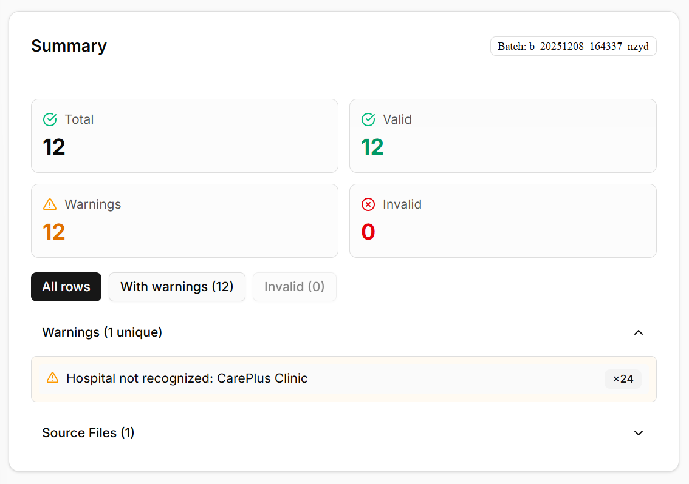
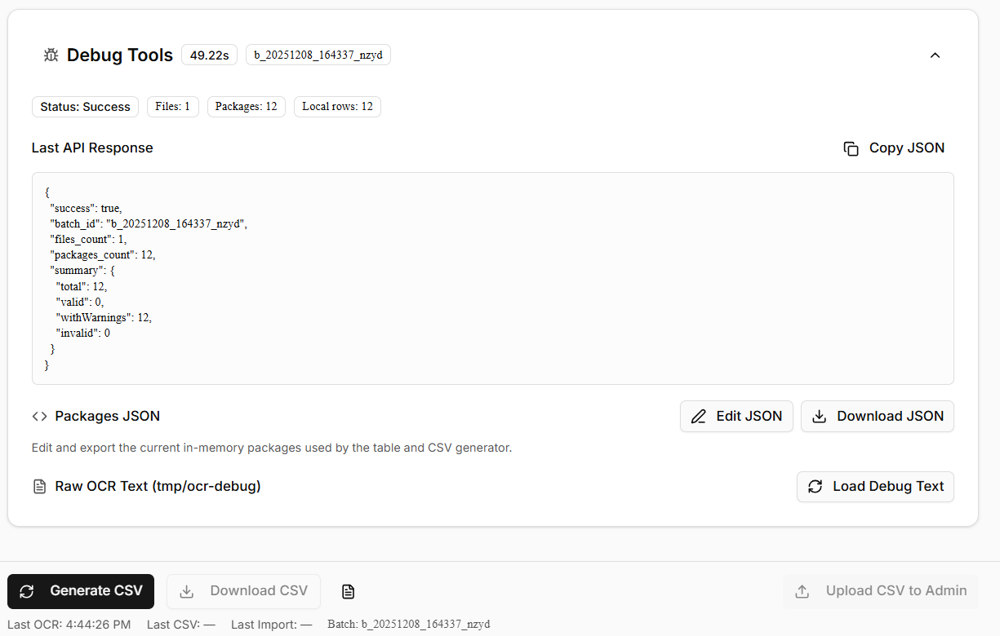
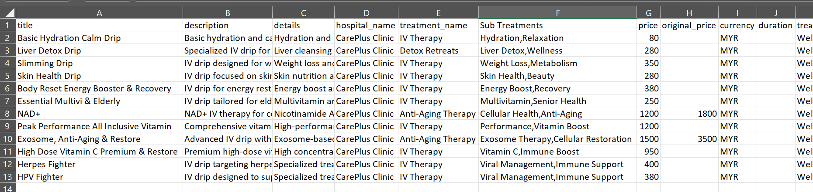

# There was an attempt
claude is sometimes doing its thing. 

## Local Development – Quick Start

This project is a Next.js 14 + TypeScript app using Tailwind CSS, shadcn/ui, and a custom Clinic Menu OCR → CSV admin tool.

## Architecture
Refer to `ARCHITECTURE.md`
Prompt to Claude called in `src\services\aiExtractor.ts`

### Prerequisites

- **Node.js** ≥ 18 (20.x recommended)
- **npm** ≥ 9  
- **git**

### 1. Clone the repository

```bash
git clone <REPO-URL> lemedica
cd lemedica
```
### 2. Install dependencies
`npm install`

This pulls in:
- next, react, react-dom
- tailwindcss, @tailwindcss/postcss, postcss, autoprefixer
- lucide-react, class-variance-authority, tailwind-merge
- Radix primitives (e.g. @radix-ui/react-toast, @radix-ui/react-dialog, etc.)
- Any other UI / OCR / AWS / Bedrock dependencies defined in package.json
- If you’ve just pulled the repo and something is missing, run npm install again after updating package.json.

### 3. Environment variables
- Create file at project root `cp .env.local`
```bash
    # Base URL for local dev
    APP_BASE_URL=http://localhost:3000

    # Optional override for forwarding CSV to the existing bulk importer.
    # If not set, the app will fall back to:
    #   http://localhost:3000/api/admin/bulk-import-packages
    BULK_IMPORT_ENDPOINT=

    # Toggle OCR debug behaviour in the backend (if used in your code)
    OCR_DEBUG_ENABLED=true

    # Any AWS / Bedrock credentials your backend needs.
    # (Adjust names to match your existing backend code.)
    AWS_REGION=ap-southeast-1
    AWS_ACCESS_KEY_ID=your-key
    AWS_SECRET_ACCESS_KEY=your-secret
    BEDROCK_MODEL_ID=your-model-id
``` 
### 4. Start the dev server
From project root: `npm run dev`
By default, Next.js runs on:
http://localhost:3000
The OCR admin page lives at:
http://localhost:3000/admin/clinic-menus/ocr

## UI/UX
Currently looks like this: 




Saves to a csv: 



## Pending To-Do's: 
1. UI/UX fix
    - logo for invalid lines used for warning lines in summary panel: both should be distinct. 
    - toggle columns: when rechecked after unchecking, gets added to the back instead of its original position
        
2. Backend To-Do's
    - multipage recognition not very strong. could just be this one in particular 
    - multifile recognition is also dogshit.
    - chinese gives very wonky results, not the strongest at inferring. 
